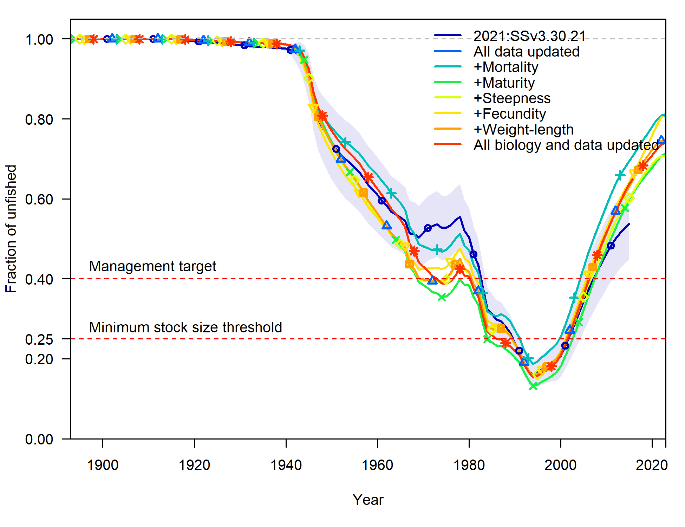

\clearpage
\floatplacement{figure}{H}

# Figures

{width=100%, height=100%, alt='Map of U.S. West Coast showing indicating coastwide management, assessment, and survey structure, and state-specific fleet structure'}

{width=100%, height=100%, alt='Horizontal bar plot showing data types available by year for each fleet. Commerical catches started in the early 1900s, and recreational in the 1920s for California and around 1970 for other states. Commercial and recreational composition data started in the 1970s and 1980s, with fewer years of age data compared to lengths. Fishery independent indices and composition data started in the 1980s'}

{width=100%, height=100%, alt="Stacked bar plot showing catches are mainly from trawl fleets, were high from 1940-2000, foreign fishing peaked in the 1970s, fishing was near zero from 2000-2015, and then increased modestly"}

{width=100% height=100% alt="Bubble plot of California trawl length compositions for males, females, and unsexed fish"}

{width=100% height=100% alt="Bubble plot of Oregon trawl length compositions for males and females"}

{width=100% height=100% alt="Bubble plot of Washington trawl length compositions for males, females, and unsexed fish"}

{width=100% height=100% alt="Bubble plot of California non-trawl length compositions for males, females, and unsexed fish"}

{width=100% height=100% alt="Bubble plot of Oregon non-trawl length compositions for males and females"}

{width=100% height=100% alt="Bubble plot of Washington non-trawl length compositions for males and females"}

{width=100% height=100% alt="Bubble plot of California trawl age compositions for males and females"}

{width=100% height=100% alt="Bubble plot of Oregon trawl age compositions for males and females"}

{width=100% height=100% alt="Bubble plot of Washington trawl age compositions for males and females"}

{width=100% height=100% alt="Bubble plot of California non-trawl age compositions for males and females"}

{width=100% height=100% alt="Bubble plot of Oregon non-trawl age compositions for males and females"}

{width=100% height=100% alt="Bubble plot of Washington non-trawl age compositions for males and females"}

{width=100% height=100% alt="Bubble plot of Oregon at-sea-hake length compositions for males and females"}

{width=100% height=100% alt="Bubble plot of Washington at-sea-hake length compositions for males and females"}

{width=100% height=100% alt="Bubble plot of Oregon at-sea-hake age compositions for males and females"}

{width=100% height=100% alt="Bubble plot of Washington at-sea-hake age compositions for males and females"}

{width=100% height=100% alt="Bubble plot of California recreational length compositions for unsexed fish"}

{width=100% height=100% alt="Bubble plot of Oregon recreational length compositions for males, females, and unsexed fish"}

{width=100% height=100% alt="Bubble plot of Washington non-trawl length compositions for males, females, and unsexed fish"}

{width=100% height=100% alt="Aggregate plots of length compositions for males, females, and unsexed fish across all length distributions"}

{width=100% height=100% alt="Bubble plot of Oregon recreational age compositions for males and females"}

{width=100% height=100% alt="Bubble plot of Washington recreational age compositions for males and females"}

## Biology

{width=100% height=100% alt="Two logistic curves for 2015 and 2023, 2015 is shifted left of 2023 and asymptotes below 1, 2023 asymptotes at 1"}

{width=100%, height=100%, alt="Two exponential curves for 2015 and 2023, 2023 is lower"}

{width=100%, height=100%,
alt="Exponential weight-length curves for males and females nearly overlapping, with relatively small spread of data"}

{width=100%, height=100%, alt="2015 and 2023 exponential weight-length relationships nearly overlapping"}

{width=100%, height=100%, alt="Figure showing age-length data and four fitted curves for north and south males and females. Females are larger than males, but northern individuals are only slightly larger than southern individuals"}

{width=100%, alt='Figure showing fraction female close to 50% until around age 20 when it becomes almost all male'}

{width=100%, alt='Figure showing fraction female close to 50% until around 45 when it becomes almost all female'}

## Model bridging

{width=100%, alt='Figure showing spawning output from 2015 benchmark is similar when using the 2015 and 2023 versions of stock synthesis'}

{width=100%, alt='Figure showing spawning output relative to unfished from 2015 benchmark is similar when using the 2015 and 2023 versions of stock synthesis'}

{width=100%, alt='Figure showing changes from the 2015 benchmark assessment as data are updated. Updating fishery data continue the increase in recovery while updating survey data result in recent declines'}

{width=100%, alt='Figure showing patterns in spawning output relative to unfished are similar to spawning output as data are updated from 2015 benchmark'}

{width=100%, alt='Figure showing scale of spawning output changes from the 2015 benchmark as biological parameters are updated'}

{width=100%, alt='Figure showing spawning output relative to unfished are generally similar to the 2015 benchmark as biological parameters are updated'}

{width=100%, alt='Figure showing greater spawning output compared to 2015 benchmark when natural mortality is age-invariant'}

{width=100%, alt='Figure showing spawning output relative to unfished declines when natural mortality is age-invariant compared to the 2015 benchmark'}

{width=100%, alt='Figure showing that changing the spatial population structure has little effect on spawning output but that applying current best practices for data weighting result in a greater decline in spawning output compared to the 2015 bechmark'}

{width=100%, alt='Figure showing that changing the spatial population structure has little effect on spawning output relative to unfished but that applying current best practices for data weighting result in a greater decline compared to the 2015 bechmark'}

{width=100%, alt='Figure showing that allowing sex-dpendent selectivity decreases initial and increases recent spawning output'}

{width=100%, alt='Figure showing that allowing sex-dpendent selectivity increases recent spawning output relative to unfished'}


## Diagnostics

{width=100%, alt='Figure showing five retrospective runs with slightly lower estimates of initial and ending spawning output compared to the base model'}

```{r, results = 'asis'}
sa4ss::add_figure(
filein = file.path(dir, "models", paste0(model_name,"_retro"), "compare2_spawnbio_uncertainty.png"), 
caption = "Change in spawning output when the most recent five years of data are sequentially removed from the model",
alt_caption = "Figure showing five retrospective runs with slightly lower estimates of initial and ending spawning output compared to the base model",
label = 'retro_bio')
```

```{r, results = 'asis'}
sa4ss::add_figure(
filein = file.path(dir, "models", paste0(model_name,"_retro"), "compare4_Bratio_uncertainty.png"), 
caption = "Change in spawning output relative to unfished when the most recent five years of data are sequentially removed from the model",
alt_caption = "Figure showing five retrospective runs with similar estimates for fraction of unfished compared to the base model",
label = 'retro_relbio')
```

{width=100%, alt='Figure showing biomass trajectories showing a decline to 2000 followed by an increase until the end year of the assessment'}

## Model results

### Estimated growth

{width=100%, alt='Figure showing length at age relationship for males and females with females reaching a greater maximium size at age than males'}

### Selectivity

```{r, results = 'asis'}
sa4ss::add_figure(
filein = file.path(dir, "models", paste0(model_name), "selectivity_comm.png"), 
caption = "Selectivity curves for commercial fleets over time for females",
alt_caption = "Figure showing logistic curves of length-based selectivty that tend to be shifted towards larger fish in the earlier time periods",
label = 'comm-selex-female')
```

```{r, results = 'asis'}
sa4ss::add_figure(
filein = file.path(dir, "models", paste0(model_name), "selectivity_comm_males.png"), 
caption = "Selectivity curves for commercial fleets over time for males",
alt_caption = "Figure showing logistic curves of length-based selectivty that tend to be shifted towards larger fish in the earlier time periods and show a steep truncation at larger sizes",
label = 'comm-selex-male')
```

```{r, results = 'asis'}
sa4ss::add_figure(
filein = file.path(dir, "models", paste0(model_name), "selectivity_noncomm.png"), 
caption = "Selectivity curves for recreational and survey fleets over time for females",
alt_caption = "Figure showing logistic curves of length-based selectivty that tend to be shifted towards smaller fish in the earlier time periods for recreational fleets. Survey curves are not time varying",
label = 'noncomm-selex-female')
```

```{r, results = 'asis'}
sa4ss::add_figure(
filein = file.path(dir, "models", paste0(model_name), "selectivity_noncomm_males.png"), 
caption = "Selectivity curves for recreational and survey fleets over time for males",
alt_caption = "Figure showing logistic curves of length-based selectivty that tend to be shifted towards smaller fish in the earlier time periods for recreational fleets. Survey curves are not time varying. All curves show a steep truncation at larger sizes",
label = 'noncomm-selex-male')
```

```{r, results = 'asis'}
sa4ss::add_figure(
filein = file.path(dir, "models", paste0(model_name), "UnavailableSpawningOutput.png"), 
caption = "Proportion of spawning output unavailable due to selectivity for small and large fish. Panels are the amount (a: top left) and proportion (b: top right) of spawning output that is unavailable; c) mean age over time (bottom left); and d) mean selectivity of all fleets over time (bottom right)",
alt_caption = "Four panel figure showing high proportion of unavailable biomass before 1940s, a lower proportion from 1940 to 2000, and an increasing proportin since 2000",
label = 'unavail-bio')
```

### Recruitment

_with_95_asymptotic_intervals.png){width=100%, alt='Figure recruits with estimated variability peaking in the 1960s, declining through the 1990s, and staying not trending until increasing in recent years'}

{width=100%, alt='Figure recruits with estimated variability peaking in the 1960s, declining through the 1990s, and staying not trending until increasing in recent years'}

{width=100%, alt='Figure showing lowering of spawning output with recruits in early years generally falling above the curve and recruits in recent years falling below the time series'}

{width=100%, alt='Figure showing lowering of spawning output with recruits in early years generally falling above the curve and recruits in recent years falling below the time series'}

### Time series

{width=100%, alt='Figure showing lowering of spawning output into 1990s and slow increase since'}

.png){width=100%, alt='Figure showing total biomass similar in pattern to spawning output'}

{width=100%, alt='Figure showing similar trends to spawning output surpassing the 0.4 target around 1980, going below the 0.25 threshold shortly thereafter, and then recovering to between the threshold and target starting in around 2015'}

{width=100%, alt='Figure showing fishing intensity increasing in the 1940, surpassing 0.5 consistently in the 1960s, declining greatly in 2000 and reching near 0.4 in 2022'}

### Fits to data

#### Length compositions

{width=100%, alt='Figure showing fits of modeled length composition for all fleets generally matching the distribution observed in the data'}

{width=100%, alt='Figure showing bubble plot of Pearson residuals with limited pattern except from not fitting decline as steeply in early years'}

{width=100%, alt='Two panel figure with uncertainty around each point of mean length slightly decreasing in early years and stable since'}

{width=100%, alt='Figure showing bubble plot of Pearson residuals with limited pattern except from not fitting decline as steeply in early years'}

{width=100%, alt='Figure of mean length with uncertainty around each point showing a decrease early years, stable until 2010, and increasing since'}

{width=100%, alt='Figure showing bubble plot of Pearson residuals with limited pattern'}

{width=100%, alt='Two panel figure with uncertainty around each point of mean length slightly decreasing in early years and stable since'}

{width=100%, alt='Figure showing bubble plot of Pearson residuals with limited pattern'}

{width=100%, alt='Two panel figure with uncertainty around each point of mean length changing little except an increase in the most recent years'}

{width=100%, alt='Figure showing bubble plot of Pearson residuals with limited pattern and indicating bimodality in recent years'}

{width=100%, alt='Figure with uncertainty around each point of sparse mean length data declining to 2000, experiencing a shift downward until 2020, after which length shifts upward'}

{width=100%, alt='Figure showing bubble plot of Pearson residuals with limited pattern'}

{width=100%, alt='Figure with uncertainty around each point of sparse and variable mean length data'}

{width=100%, alt='Figure showing bubble plot of Pearson residuals with limited pattern'}

{width=100%, alt='Figure with uncertainty around each point of mean length data that cycles over time'}

{width=100%, alt='Figure showing bubble plot of Pearson residuals with limited pattern excpet for some underfitting of large length between 1992 and 2008'}

{width=100%, alt='Two panel figure with uncertainty around each point of mean length that is variable and slightly increasing over time'}

{width=100%, alt='Figure showing bubble plot of Pearson residuals with limited pattern and indicating bimodality in recent years'}

{width=100%, alt='Two panel figure with uncertainty around each point of mean length that is generally unchanging over time with an increase in recent years'}

{width=100%, alt='Figure showing bubble plot of Pearson residuals with limited pattern'}

{width=100%, alt='Figure with uncertainty around each point of mean length that is unchanging over time'}

{width=100%, alt='Figure showing bubble plot of Pearson residuals with underfitting of larger lengths in the early 2000s'}

{width=100%, alt='Figure with uncertainty around each point of mean length that is unchanging over time'}

{width=100%, alt='Figure showing bubble plot of Pearson residuals with limited pattern'}

{width=100%, alt='Figure with uncertainty around each point of mean length that is variable but non-trending over time'}

{width=100%, alt='Figure showing bubble plot of Pearson residuals with limited pattern'}

{width=100%, alt='Figure with uncertainty around each point of mean length that is declining over time'}

{width=100%, alt='Figure showing bubble plot of Pearson residuals with limited pattern'}

{width=100%, alt='Figure with uncertainty around each point of mean length that is increasing over time'}

#### Age compositions

{width=100%, alt='Figure showing fits of modeled age composition for all fleets generally matching the distribution observed in the data'}